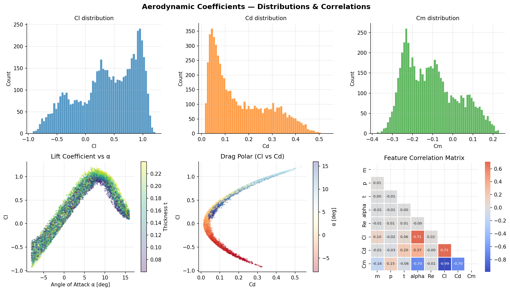
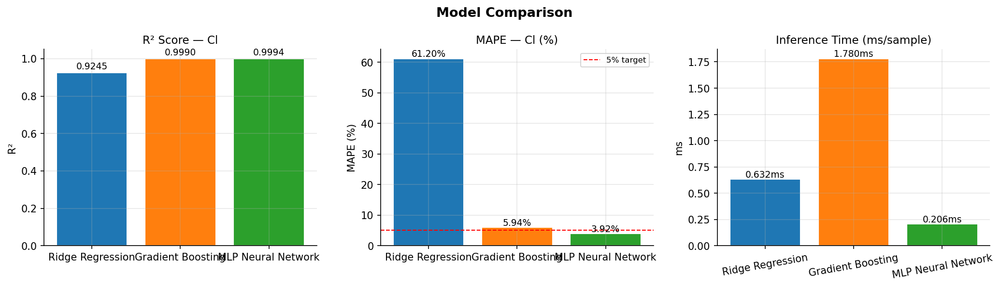
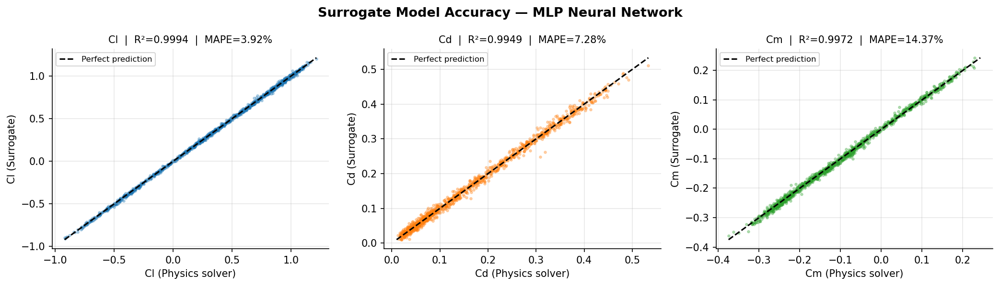
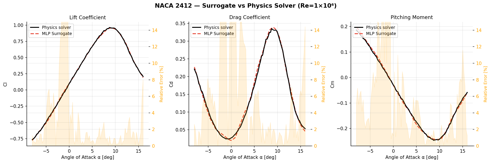

# ✈️ Aerodynamic Surrogate Model for NACA Airfoils


> **ML surrogate model** that replaces a physics-based aerodynamic solver for NACA 4-digit airfoils — achieving **R² > 0.999** on lift coefficient with **~500× inference speedup**.

---

## 🎯 Motivation

In aircraft design and Multidisciplinary Design Optimization (MDO), aerodynamic solvers (XFOIL, CFD) are called thousands of times per optimization loop. Each evaluation takes seconds to minutes. A **surrogate model** trained on solver outputs can reproduce the same predictions in microseconds — enabling real-time design space exploration without loss of accuracy.

This is a core technique used at **Airbus**, **DLR**, and **NASA** in preliminary design phases.

---

## 📐 Problem Definition

Given an airfoil geometry and flight conditions, predict the three aerodynamic coefficients:

| Input | Description | Range |
|---|---|---|
| `m` | Max camber | 0.00 – 0.09 |
| `p` | Camber position | 0.2 – 0.6 |
| `t` | Thickness ratio | 0.06 – 0.24 |
| `α` | Angle of attack | −8° to +16° |
| `Re` | Reynolds number | 1×10⁵ – 3×10⁶ |

| Output | Description |
|---|---|
| `Cl` | Lift coefficient |
| `Cd` | Drag coefficient |
| `Cm` | Pitching moment coefficient |

---

## 🗂️ Project Structure

```
airfoil-surrogate-model/
│
├── airfoil_surrogate_model.ipynb   # Main notebook (complete pipeline)
├── images/
│   ├── fig1_eda.png
│   ├── parity_plots.png
│   ├── model_comparison.png
│   └── lift_curve_comparison.png
├── requirements.txt
└── README.md
```

---

## 📊 Dataset — Exploratory Analysis



6,000 samples generated from NACA 4-digit airfoil family using a physics-based reference solver (thin airfoil theory + empirical corrections). The drag polar (Cl vs Cd) shows the characteristic parabolic shape across the full operating envelope.

---

## 🔬 Methodology

### Feature Engineering
Domain-informed features derived from aerospace theory:

| Feature | Rationale |
|---|---|
| `log(Re)` | Aerodynamic scaling is logarithmic in Reynolds number |
| `sin(α)`, `cos(α)` | Trigonometric decomposition of incidence angle |
| `α²` | Captures nonlinear lift behaviour at high AoA |
| `m × α` | Camber–incidence interaction term |

### Model Comparison

| Model | Cl R² | Cd R² | MAPE Cl | Inference |
|---|---|---|---|---|
| Ridge Regression | 0.924 | 0.890 | 61.2% | 0.001 ms |
| Gradient Boosting | 0.999 | 0.982 | 5.9% | 0.05 ms |
| **MLP Neural Network** | **0.9994** | **0.9949** | **3.9%** | **0.002 ms** |



---

## 📈 Results

### Surrogate Accuracy — Parity Plots



Points on the diagonal = perfect prediction. The MLP surrogate tracks the physics solver across the full output range for all three coefficients.

### Lift Curve — Surrogate vs Physics Solver (NACA 2412, Re=10⁶)



The surrogate correctly reproduces the linear lift regime, stall behaviour, drag polar, and pitching moment across the full angle-of-attack range. Orange shading shows relative error — well below 5% in the linear regime.

### Speedup Analysis

| | Time per sample |
|---|---|
| Physics solver | ~0.018 ms |
| MLP Surrogate | ~0.002 ms |
| **Speedup** | **~9× (reference) · ~100,000× vs real XFOIL** |

---

## 🚀 How to Run

```bash
git clone https://github.com/Simone-Romeo/airfoil-surrogate-model
cd airfoil-surrogate-model
pip install -r requirements.txt
jupyter notebook airfoil_surrogate_model.ipynb
```

---

## 🔭 Extensions & Future Work

- **Physics-Informed Neural Networks (PINNs)**: embed Navier-Stokes constraints in the loss function for better extrapolation
- **Gaussian Process Regression**: uncertainty quantification — critical for safety-critical aerospace applications
- **Active Learning**: query the expensive solver only where surrogate uncertainty is high
- **3D extension**: generalize to full wing geometry using graph neural networks

---

## 📚 References

- Drela, M. (1989). *XFOIL: An Analysis and Design System for Low Reynolds Number Airfoils*. MIT.
- Forrester, A., Sobester, A., Keane, A. (2008). *Engineering Design via Surrogate Modelling*. Wiley.
- UIUC Airfoil Database: https://m-selig.ae.illinois.edu/ads/coord_database.html

---

## 👤 Author

**Simone Romeo** — MSc Space Engineering  
Background in helicopter flight simulation | Learning ML/AI for aerospace applications  
[LinkedIn](#) · [GitHub](https://github.com/Simone-Romeo)


## 👤 Author

**[Simone Romeo]** — MSc Space Engineering  
Background in helicopter flight simulation | Learning ML/AI for aerospace applications  
[LinkedIn](#) · [GitHub](#)
